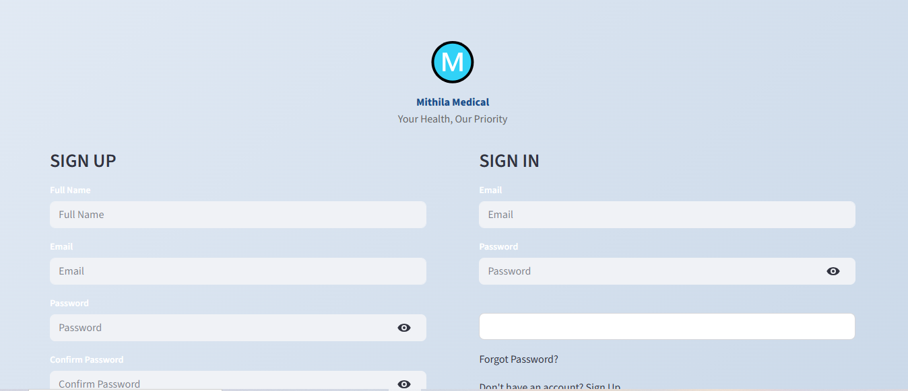

# Mithila Medical - Medical Store Management System

## Project Name
**Mithila Medical Store Management System**

## Project Description
A comprehensive full-stack web application for managing medical store operations. Enables customers to search medicines, place orders, and track deliveries. Provides store staff with AI-powered inventory management, order processing, and sales analytics through an intelligent chatbot interface. Built with Streamlit frontend, MySQL backend, and LangChain AI integration.

---

## Features

### 🛍️ Customer Portal
- **User Authentication**: Secure signup and login system
- **Medicine Search**: Search medicines by name with real-time inventory checks
- **Order Placement**: Intuitive order form with delivery address management
- **Order Tracking**: Track orders with real-time status updates (Pending, Processing, Delivered)
- **Order History**: View complete order history with details

### 👨‍💼 Staff Management
- **Role-Based Access**: Separate customer and staff accounts
- **AI Assistant**: Conversational AI for querying inventory and orders
- **Dashboard**: Real-time statistics (total medicines, stock, low-stock items)
- **Inventory Management**: Add/update medicines with pricing and descriptions
- **Quick Queries**: Pre-built queries for common staff operations
- **Order Management**: View and update order statuses

### 🤖 AI Features
- **LangChain Integration**: Natural language queries for database operations
- **SQLDatabase Toolkit**: Automated SQL query generation
- **Context-Aware Responses**: Understands staff queries and provides formatted results
- **Error Handling**: Graceful error messages and suggestions

---

## Tech Stack

### Frontend
- **Streamlit**: Interactive web UI framework
- **Python**: Backend logic

### Backend
- **Flask/Streamlit**: Web server
- **MySQL**: Primary database
- **SQLAlchemy/SQLDatabase**: ORM and database toolkit
- **LangChain**: AI/LLM integration
- **LangGraph**: Workflow orchestration for multi-step operations

### Database
- **MySQL 8.0+**: Relational database
- **SQLite**: Local authentication database

### AI & LLM
- **OpenAI GPT-4o-mini**: Language model
- **LangChain Core**: Framework for building with LLMs
- **LangGraph**: State management and graph-based workflows

---

## Database Schema

### Users Table (SQLite - auth.db)
```sql
CREATE TABLE users (
    user_id INTEGER PRIMARY KEY AUTOINCREMENT,
    email TEXT UNIQUE NOT NULL,
    password TEXT NOT NULL,
    full_name TEXT NOT NULL,
    role TEXT DEFAULT 'customer',
    created_at TIMESTAMP DEFAULT CURRENT_TIMESTAMP
);
```

### Medicines Table (MySQL - store)
```sql
CREATE TABLE medicines (
    medicine_id INT PRIMARY KEY AUTO_INCREMENT,
    medicine_name VARCHAR(255) NOT NULL,
    quantity INT NOT NULL DEFAULT 0,
    price DECIMAL(10, 2),
    description TEXT,
    category VARCHAR(100),
    manufacturer VARCHAR(100),
    expiry_date DATE,
    created_at TIMESTAMP DEFAULT CURRENT_TIMESTAMP
);
```

### Orders Table (MySQL - store)
```sql
CREATE TABLE orders (
    order_id INT PRIMARY KEY AUTO_INCREMENT,
    user_id INT NOT NULL,
    medicine_id INT NOT NULL,
    quantity INT NOT NULL,
    customer_name VARCHAR(255),
    phone VARCHAR(10),
    address TEXT,
    city VARCHAR(100),
    pincode VARCHAR(6),
    status ENUM('Pending', 'Processing', 'Delivered', 'Cancelled'),
    total_price DECIMAL(10, 2),
    payment_method VARCHAR(50),
    created_at TIMESTAMP DEFAULT CURRENT_TIMESTAMP,
    delivery_date DATE,
    FOREIGN KEY (user_id) REFERENCES users(user_id),
    FOREIGN KEY (medicine_id) REFERENCES medicines(medicine_id)
);
```

---

## Installation & Setup

### Prerequisites
- Python 3.9+
- MySQL 8.0+
- OpenAI API Key
- pip (Python package manager)

### Step 1: Clone Repository
```bash
git clone <repository-url>
cd mithila-medical
```

### Step 2: Create Virtual Environment
```bash
python -m venv venv
source venv/bin/activate  # On Windows: venv\Scripts\activate
```

### Step 3: Install Dependencies
```bash
pip install -r requirements.txt
```

### Step 4: Setup Environment Variables
Create a `.env` file in the root directory:
```env
OPENAI_API_KEY=your_openai_api_key_here
MYSQL_USER=your_mysql_user
MYSQL_PASSWORD=your_mysql_password
MYSQL_HOST=localhost
MYSQL_PORT=3306
MYSQL_DATABASE=store
```

### Step 5: Setup MySQL Database
```bash
mysql -u root -p
CREATE DATABASE store;
USE store;

CREATE TABLE medicines (
    medicine_id INT PRIMARY KEY AUTO_INCREMENT,
    medicine_name VARCHAR(255) NOT NULL,
    quantity INT NOT NULL DEFAULT 0,
    price DECIMAL(10, 2),
    description TEXT,
    category VARCHAR(100),
    manufacturer VARCHAR(100),
    expiry_date DATE,
    created_at TIMESTAMP DEFAULT CURRENT_TIMESTAMP
);

CREATE TABLE orders (
    order_id INT PRIMARY KEY AUTO_INCREMENT,
    user_id INT NOT NULL,
    medicine_id INT NOT NULL,
    quantity INT NOT NULL,
    customer_name VARCHAR(255),
    phone VARCHAR(10),
    address TEXT,
    city VARCHAR(100),
    pincode VARCHAR(6),
    status ENUM('Pending', 'Processing', 'Delivered', 'Cancelled') DEFAULT 'Pending',
    total_price DECIMAL(10, 2),
    payment_method VARCHAR(50),
    created_at TIMESTAMP DEFAULT CURRENT_TIMESTAMP,
    delivery_date DATE,
    FOREIGN KEY (user_id) REFERENCES users(user_id),
    FOREIGN KEY (medicine_id) REFERENCES medicines(medicine_id)
);
```

### Step 6: Run Application
```bash
streamlit run f.py
```

The application will be available at `http://localhost:8501`

---

## File Structure
```
mithila-medical/
├── f.py                      # Main Streamlit app (home.py)
├── backend.py               # LangChain/LangGraph setup & chatbot
├── admin_setup.py           # Admin authentication functions
├── admin_medicines.py       # Staff dashboard & management
├── search_medicines.py      # Customer medicine search
├── place_order.py          # Order placement form
├── track_order.py          # Order tracking page
├── requirements.txt        # Python dependencies
├── .env                    # Environment variables
├── auth.db                 # SQLite auth database
└── README.md              # This file
```

---

## User Roles

### 👤 Customer
- Browse and search medicines
- Place orders with delivery details
- Track order status in real-time
- View order history

### 👨‍💼 Staff/Admin
- Access admin dashboard
- View inventory statistics
- Add/update medicines
- Process and manage orders
- Use AI Assistant for data queries

---

## AI Assistant Commands (Staff)

### Inventory Queries
```
"Show low stock medicines"
"What's the stock of Paracetamol?"
"Show medicines expiring soon"
"List all medicines by category"
```

### Order Queries
```
"Show pending orders"
"Find order #123"
"Show orders for customer John"
"How many orders are processing?"
```

### Sales & Analytics
```
"Total revenue from delivered orders"
"Top selling medicines"
"Show delivered orders this month"
```

---

## Security Features
- **Password Hashing**: SHA-256 encryption for user passwords
- **Role-Based Access Control**: Separate access levels for customers and staff
- **SQL Injection Protection**: Parameterized queries via LangChain
- **Session Management**: Streamlit session state for user authentication

---

## API Integration
- **OpenAI API**: GPT-4o-mini for natural language understanding
- **LangChain Community**: SQLDatabase toolkit for safe SQL generation
- **LangGraph**: Multi-step workflow execution

---

## Future Enhancements
- 💳 Payment Gateway Integration (Razorpay/Stripe)
- 📱 SMS/Email Notifications
- 📊 Advanced Analytics & Reports
- 🗺️ Google Maps Integration for delivery tracking
- 🏥 Prescription Upload & Management
- ⭐ Customer Reviews & Ratings
- 📦 Inventory Forecasting with ML

---

## Troubleshooting

### MySQL Connection Error
- Verify MySQL is running
- Check credentials in `.env` file
- Ensure database `store` exists

### OpenAI API Error
- Verify API key in `.env`
- Check API rate limits
- Ensure account has sufficient credits

### Streamlit Port Already in Use
```bash
streamlit run f.py --server.port 8502
```

---

## Contributing
1. Fork the repository
2. Create feature branch (`git checkout -b feature/AmazingFeature`)
3. Commit changes (`git commit -m 'Add AmazingFeature'`)
4. Push to branch (`git push origin feature/AmazingFeature`)
5. Open Pull Request

---

## License
This project is licensed under the MIT License - see LICENSE file for details.

---

## Support
For issues and questions, please create an issue in the repository or contact the development team.

---

## Authors
- **Development Team**: Sachin & Contributors
- **Project Manager**: Mithila Medical Team

---

**Last Updated**: January 2025
**Version**: 1.0.0