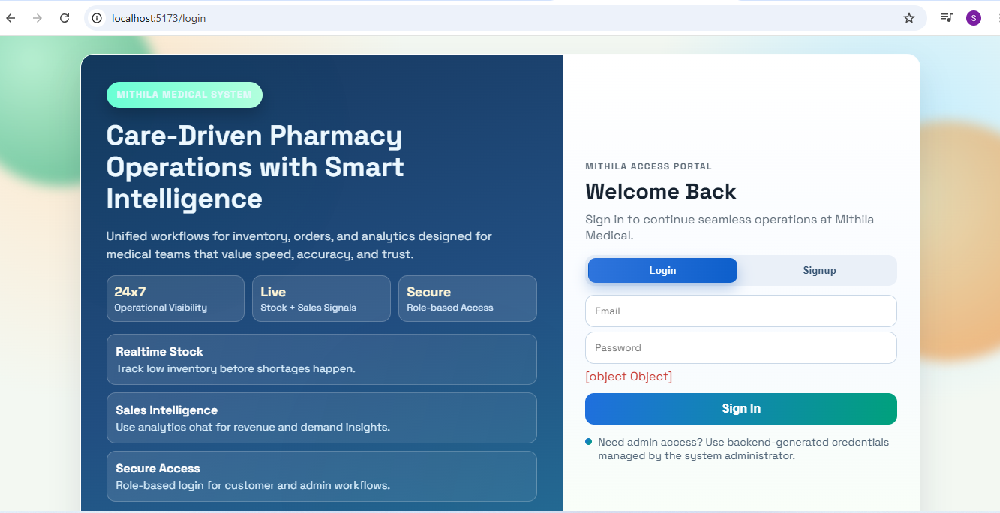
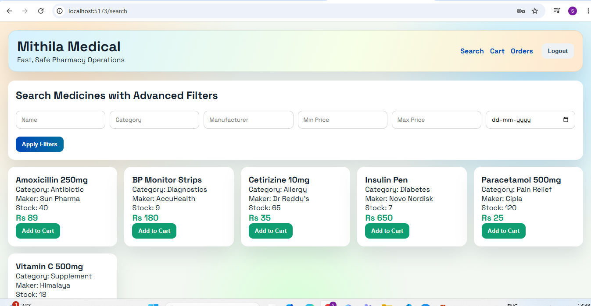
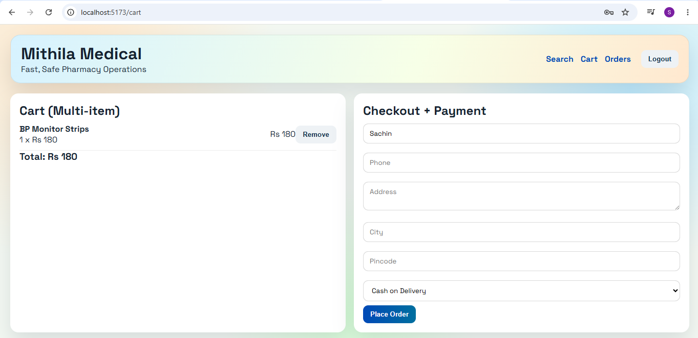
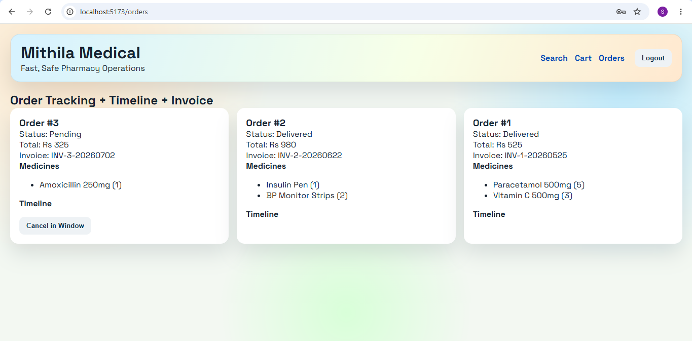
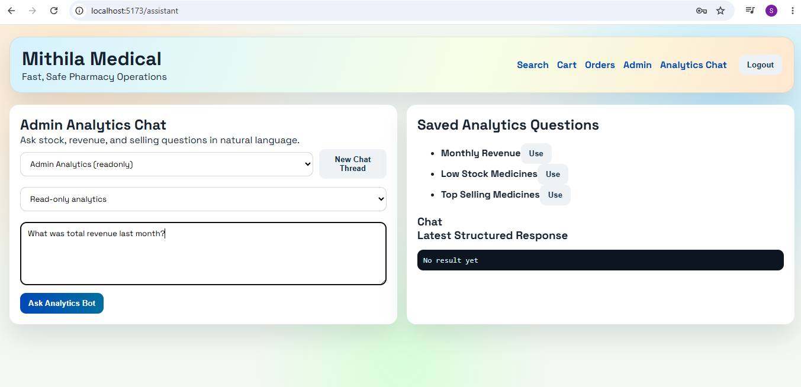

# Mithila Medical - React + FastAPI

Production-style medical store management system with:
- React frontend
- FastAPI backend
- PostgreSQL database
- Docker Compose deployment

## Active Architecture
- Frontend: `frontend_react`
- Backend: `backend_fastapi`
- Orchestration: `docker-compose.yml`

## Quick Start (Docker)
1. Build and run everything:

```bash
docker compose up --build -d
```

2. Open applications:
- Frontend: http://localhost:5173
- Backend health: http://localhost:8000/health
- Backend API base: http://localhost:8000/api

3. Stop services:

```bash
docker compose down
```

## Local Run (Without Docker)
### Backend
```bash
cd backend_fastapi
pip install -r requirements.txt
uvicorn app.main:app --reload --port 8000
```

### Frontend
```bash
cd frontend_react
npm install
npm run dev
```

## Implemented Feature Set
- Customer signup/login
- Backend-generated admin user (no public admin signup)
- Medicine search with filters (category, manufacturer, price, expiry)
- Cart and multi-item checkout
- Payment method flow (COD/UPI/CARD model)
- Order timeline + invoice payload
- Order cancellation window
- Staff inventory edit tools
- Bulk CSV import for medicines
- Low-stock reorder suggestions
- Notification log hooks for SMS/email
- Admin-only analytics chatbot for stock/revenue/sales questions
- LLM chatbot implementation using FastAPI + LangChain + LangGraph + OpenAI `gpt-4o-mini`
- SQL guardrails for safe analytics-only querying
- PostgresSaver short-term chat memory for admin analytics threads

## LLM Configuration
Set these values in `backend_fastapi/.env`:

```env
OPENAI_API_KEY=your_openai_api_key
OPENAI_MODEL=gpt-4o-mini
OPENAI_TIMEOUT_SECONDS=30
```

## Project Structure
```text
.
+-- backend_fastapi/
+-- frontend_react/
+-- docker-compose.yml
+-- requirements.txt
```

## Screenshots
### Login


### User Search


### Cart


### Orders


### Admin Chatbot


## Notes
- Legacy Streamlit code has been removed from this workspace because it is no longer used by the active stack.
- Root `requirements.txt` delegates to backend dependencies.
